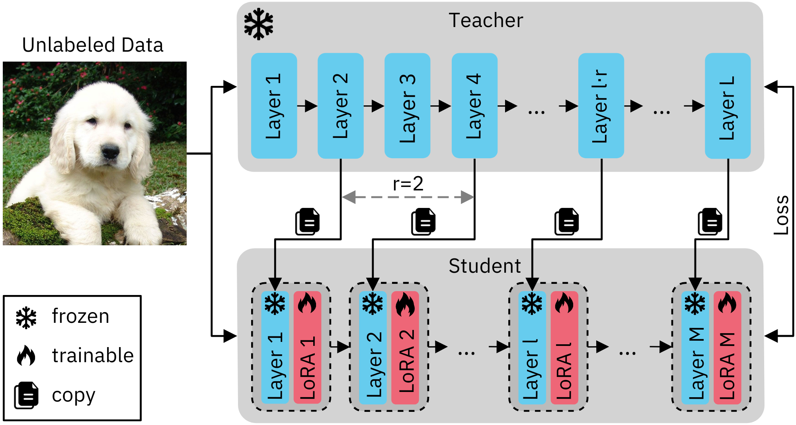

# Weight Copy and Low-Rank Adaptation for Few-Shot Distillation of Vision Transformers
### [Paper](https://arxiv.org/abs/2404.09326) | [Webpage]()
This repository contains the official implementation of our paper **"Weight Copy and Low-Rank Adaptation for Few-Shot Distillation of Vision Transformers"**, presented at WACV 2025.


# About 

Few-shot knowledge distillation has emerged as a promising way to leverage the knowledge of large-scale pre-trained models with minimal data and resources. In this work, we propose a novel **few-shot feature distillation** approach tailored for Vision Transformers. Our method comprises two core components:

1. **Weight Copying**: Using the depth-consistent structure of Vision Transformers, we copy weights from intermittent layers of pre-trained teachers to create shallower student architectures. This intermittence factor allows control over the complexity of the student transformer relative to its counterpart.

 
2. **Enhanced Low-Rank Adaptation (LoRA)**: We introduce an improved LoRA technique for distilling knowledge in few-shot settings, effectively compensating for information processing from the omitted teacher layers.

Through extensive experiments on five diverse datasets—including **natural, medical, and satellite images**—using both supervised and self-supervised Vision Transformers as teachers, our approach outperforms competitive baselines. 

## Setup

Clone repo, create a conda environment and install the dependencies:
```
git clone https://github.com/dianagrigore/WeCoLoRA
cd WeCoLoRA
conda create -n WeCoLoRA python=3.8
conda activate WeCoLoRA
pip install -r requirements.txt
```

## Weight Copy and Knowledge Distillation
To obtain the distilled student using our few-shot method:
```
python main_standard_kd.py \
--batch_size 128 --accum_iter 8 \
--epochs 10 --warmup_epochs 2 \
--teacher_model vit_base_patch16_224 \
--blr 1e-3 --weight_decay 0.05 \
--output_dir supervised_lora_kd_rank128_2_with_2percent \
--lora_distillation --lora_matrix_rank 128  \
--reduction_factor 2 --few_shot --few_shot_ratio=0.02
```
### Key parameters:
- ```reduction_factor``` for skipping intermittent layers
- ```few_shot``` and ```few_shot_ratio``` for using a percentage of the data 
- ```lora_distillation``` and ```lora_matrix_rank``` for using LoRA

## Linear Probing

```
python main_linprobe.py  --batch_size 512 --epochs 50 \
 --dataset=cifar-100 --blr 0.1 \
  --finetune supervised_lora_kd_rank128_2_with_2percent/checkpoint-9.pth  \
 --output_dir linprob_cifar_supervised_lora_kd_rank128_2_with_2percent \
 --model vit_base_patch16  --nb_classes 100 \
 --data_path=../../datasets/cifar \
 --reduction_factor 2 --lora_model --lora_matrix_rank=128
```
### Key parameters:
- ```reduction_factor``` for loading a student model
- ```lora_model``` and ```lora_matrix_rank``` for using LoRA models in linear probing

## Results
__Ablation results in terms of accuracy (in percentages) on ImageNet-1K, iNaturalist19, and CIFAR-100. Results are obtained using a compression factor of r=2 with a self-supervised teacher ViT-B.__

| $\alpha$     | Weight Copy | LoRA | Enhanced LoRA | ImageNet | iNaturalist | CIFAR-100 |
|--------------|-------------|------|---------------|----------|-------------|-----------|
| **$\alpha=1\%$**  | ✗           | ✗    | ✗             | 3.5      | 2.4         | 9.1       |
|              | ✓           | ✗    | ✗             | 30.2     | 19.2        | 32.1      |
|              | ✓           | ✓    | ✗             | 32.4     | 21.6        | 30.7      |
|              | ✓           | ✗    | ✓             | **36.8** | **22.7**    | **33.3**  |
| **$\alpha=10\%$** | ✗           | ✗    | ✗             | 15.8     | 14.5        | 28.9      |
|              | ✓           | ✗    | ✗             | 53.7     | 31.2        | 48.2      |
|              | ✓           | ✓    | ✗             | 33.0     | 28.4        | 41.1      |
|              | ✓           | ✗    | ✓             | **56.0** | **34.5**    | **49.8**  |

- $\alpha$: Represents the percentage of the original ImageNet-1K training set used during knowledge distillation. Best accuracy for each dataset and $\alpha$ value is in bold.

__Results of WeCoLoRA and WeCo+KD in terms of accuracy (in percentages) on ImageNet-1K, iNaturalist, NWPU-RESISC45, and CIFAR-100, and mean AUC (in percentages) on ChestX-ray14. Results are provided for two teacher models: supervised ViT-B and self-supervised ViT-B (SSL). Only 1% of the ImageNet-1K training set was used in distillation. Best scores for each teacher, dataset, and compression rate are highlighted in bold.__

| Teacher                            | Compression factor \( r \) | Distillation method | ImageNet | ChestX-ray14 | iNaturalist | RESISC45 | CIFAR-100 |
|------------------------------------|----------------------------|---------------------|----------|--------------|-------------|----------|-----------|
| **ViT-B** (supervised)             | 2                          | WeCo+KD            | 35.5     | 67.6         | 25.4        | 58.0     | 34.8      |
|                                    |                            | WeCoLoRA           | **60.5** | **69.5**     | **43.4**    | **67.5** | **60.6**  |
|                                    | 3                          | WeCo+KD            | 7.6      | 57.2         | 6.0         | 33.3     | 11.0      |
|                                    |                            | WeCoLoRA           | **35.8** | **67.6**     | **26.6**    | **58.8** | **36.5**  |
| **ViT-B** (SSL)                    | 2                          | WeCo+KD            | 30.2     | 65.7         | 19.2        | 53.8     | 32.1      |
|                                    |                            | WeCoLoRA           | **36.8** | **66.3**     | **22.7**    | **56.8** | **33.4**  |
|                                    | 3                          | WeCo+KD            | 32.4     | **66.7**     | **21.1**    | 42.2     | 34.0      |
|                                    |                            | WeCoLoRA           | **32.9** | 66.6         | **21.1**    | **55.6** | **34.4**  |


## How to Cite
```bibtex
@article{grigore2024weight,
  title={Weight Copy and Low-Rank Adaptation for Few-Shot Distillation of Vision Transformers},
  author={Grigore, Diana-Nicoleta and Georgescu, Mariana-Iuliana and Justo, Jon Alvarez and Johansen, Tor and Ionescu, Andreea Iuliana and Ionescu, Radu Tudor},
  journal={arXiv preprint arXiv:2404.09326},
  year={2024}
}
```
